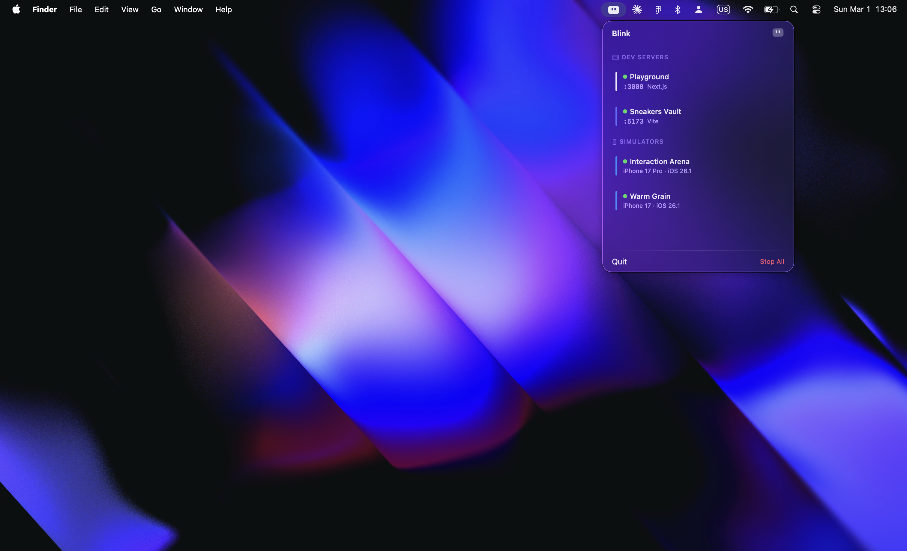

  

<h1 align="center">Blink</h1>

A little robot that lives in your menu bar and keeps an eye on your running dev servers and iOS simulators.

  
  
  

  

## Features

- **Live server monitoring** — see every dev server running on your machine with port, framework, and project name
- **Framework detection** — automatically identifies Next.js, Vite, Nuxt, Remix, Astro, Django, Flask, Rails, and more with brand-accurate colors
- **Simulator tracking** — lists all booted iOS simulators with device name and runtime version
- **Simulator focus** — click a simulator to bring its window to the front, even if minimized
- **One-click actions** — kill a server, shut down a simulator, or stop everything at once
- **Open in browser** — jump to localhost from any server entry
- **Copy to clipboard** — click any port to copy the localhost URL
- **Menu bar presence** — always know how many services are running at a glance

## Install

[**Download Blink**](https://github.com/megootronic/Blink/releases/latest) — open the DMG, drag to Applications.

Requires macOS 14 (Sonoma) or later.

## How It Works

Blink polls every few seconds using standard macOS tools:

- **Port scanning** — `lsof` to find listening TCP ports
- **Framework detection** — inspects process arguments and working directory
- **Project names** — reads `package.json`, `Cargo.toml`, or falls back to the directory name
- **Simulators** — `xcrun simctl` for booted simulator data

No background daemons, no elevated permissions, no network access. Everything runs locally.

## Tech

- SwiftUI with `MenuBarExtra`
- Swift concurrency (async/await, TaskGroup)
- `@Observable` for reactive state
- macOS 14+ (Sonoma)

## Contributing

PRs welcome. Keep it clean.

1. Fork it
2. Create your branch (`git checkout -b feature/thing`)
3. Commit (`git commit -m 'Add thing'`)
4. Push (`git push origin feature/thing`)
5. Open a PR

## Author

Built by [Mo](https://mo.software)

## License

MIT
