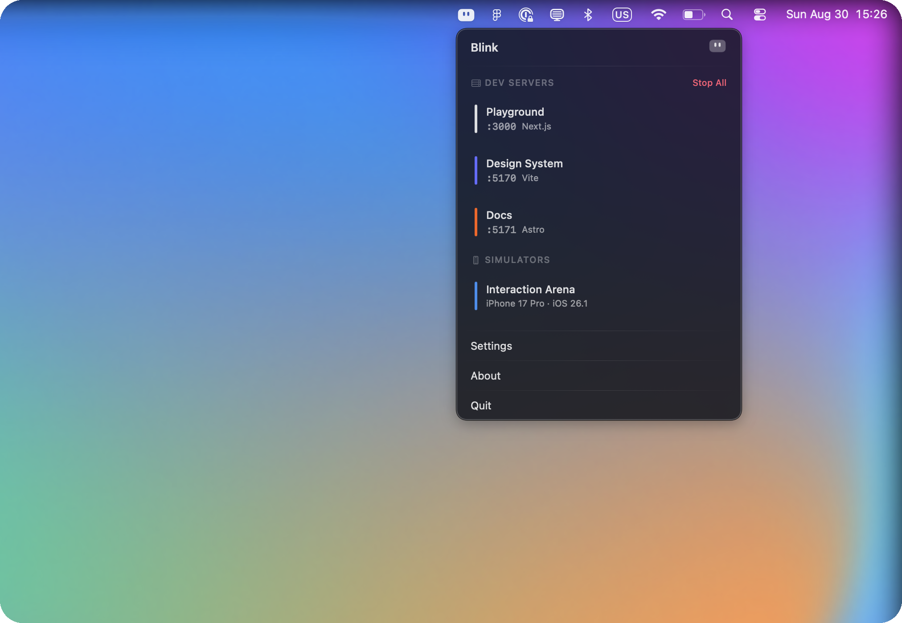

<h1 align="center">
   
  Blink
</h1>

A little robot that lives in your menu bar and keeps an eye on your running dev servers and iOS simulators.

  
  
  

  

## Features

- **Live server monitoring** — every dev server running on your machine, with port, framework and project name
- **Restart without leaving the menu bar** — stop and relaunch a dev server in one click, no terminal, no rebuild
- **Failures explained in place** — when a restart doesn't come back, the row shows why, with the full output one click from your clipboard
- **Framework detection** — Next.js, Vite, Nuxt, Remix, Astro, Django, Flask, Rails and more, each with its own colour
- **Simulator tracking** — booted simulators with device name, runtime, and the app running inside
- **Relaunch an app in the simulator** — terminate and launch without going back to Xcode
- **One-click stop** — a single server, or everything in a section
- **Open in the browser** — click a row to jump to localhost
- **Start at login** — so it's there when you are

## Install

[**Download Blink**](https://github.com/megootronic/Blink/releases/latest) — open the DMG, drag to Applications.

Requires macOS 14 (Sonoma) or later.

## Updates

Blink doesn't check for updates, and doesn't talk to the network at all.

To hear about new versions, use **Watch → Custom → Releases** on this repo and GitHub will email you.

## How It Works

Blink polls every few seconds using standard macOS tools:

- **Port scanning** — `lsof` to find listening TCP ports
- **Framework detection** — inspects process arguments and working directory
- **Project names** — reads `package.json`, `Cargo.toml`, or falls back to the directory name
- **Simulators** — `xcrun simctl` for booted simulator data

Restarting is less obvious than it sounds. The process holding a port often can't be
relaunched from its own arguments — Next.js and npm both overwrite their `argv` with a
display title, and `argv[0]` is usually a bare name like `node` rather than a path. So
Blink reads the real arguments and the resolved binary from the kernel, and walks up the
parent chain to find a process that can actually be launched again, never straying
outside the server's own project directory.

No background daemons, no elevated permissions, no network access. Everything runs locally.

## Tech

- SwiftUI, in an `NSPanel` hung off an `NSStatusItem`
- Swift concurrency (async/await, `TaskGroup`)
- `@Observable` for reactive state
- `SMAppService` for start at login
- macOS 14+ (Sonoma)

## Contributing

PRs welcome. Keep it clean.

1. Fork it
2. Create your branch (`git checkout -b feature/thing`)
3. Commit (`git commit -m 'Add thing'`)
4. Push (`git push origin feature/thing`)
5. Open a PR

## Author

Built by [Mo](https://mo.software)

## License

MIT
